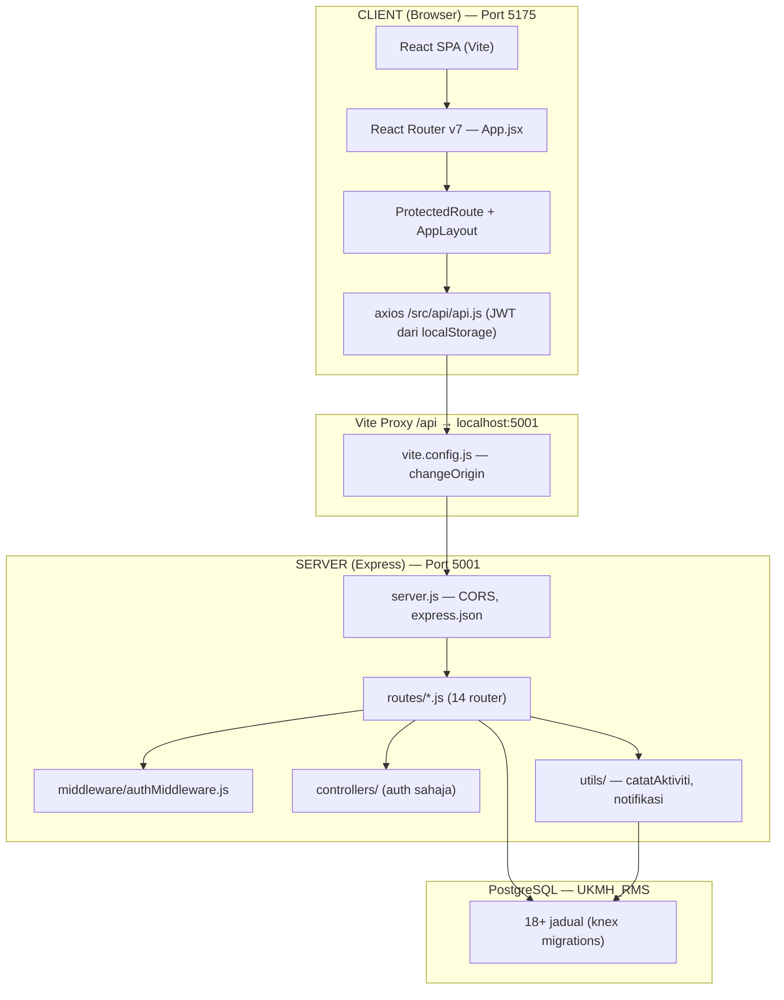
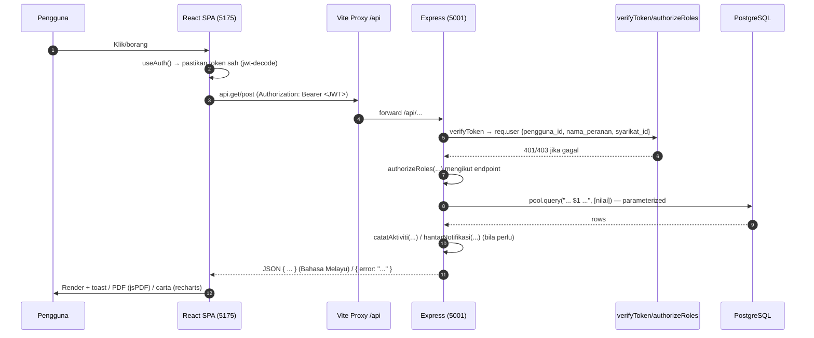

# 00 — General: Seni Bina Keseluruhan

## Tujuan

Rangka aliran end-to-end Sistem Pengurusan Risiko UKM Holdings: bagaimana satu
permintaan bergerak dari browser → Express → PostgreSQL, dan instrumen
merentas modul (auth, RBAC, audit, notifikasi) yang digunakan di mana-mana.

## Seni Bina Berek (3 Lapisan)

## Kitaran Hayat Satu Permintaan

## Peta Modul ↔ Fail

| Modul | Frontend (src/pages) | Backend (routes) | Prefix API |
|-------|----------------------|-------------------|------------|
| Autentikasi | Login, LogKeluar, Unauthorized | `auth.js` → `controllers/authController.js` | `/api/auth` |
| Paparan Utama | PaparanUtama/* | `dashboard.js` | `/api/dashboard` |
| Risiko | SenaraiRisiko/*, DaftarRisiko/* | `risiko.js` (+ `tahun.js`) | `/api/risiko`, `/api/tahun` |
| Rawatan | RawatanRisiko/*, SenaraiRisiko/kemaskinirawatan | `rawatan.js` | `/api/rawatan` |
| Pemantauan | PemantauanRisiko/*, SenaraiRisiko/KemaskiniPemantauan | `pemantauan.js` | `/api/pemantauan-risiko` |
| Pindaan | Pindaan/*, SenaraiTugasan/* | `pindaan.js` | `/api/pindaan` |
| Laporan | Laporan/* | `laporan.js` | `/api/laporan` |
| Pengguna | UrusPengguna, LogAktiviti | `users.js`, `roles.js`, `syarikat.js`, `bahagian.js`, `log_aktiviti.js` | `/api/users`, `/api/roles`, `/api/syarikat`, `/api/bahagian`, `/api/log_aktiviti` |
| Notifikasi | navbar.jsx | `notifikasi.js` | `/api/notifikasi` |

## Instrumen Merentas Modul

### Autentikasi & RBAC

- **Backend**: `verifyToken` (baca JWT → semak semula pengguna + peranan di DB,
  set `req.user`) kemudian `authorizeRoles("Admin", ...)` (Title Case).
- **Frontend**: `ProtectedRoute` (laluan terlindung), `useAuth()` →
  `isAdmin()`, `canEdit()`, `isRestrictedRole()`, `hasRole(...)`.
- Setiap query risiko **wajib** menghormati isolasi data:
  Admin/Executive = semua syarikat; Staff/Ketua Subsidiari = `WHERE syarikat_id = req.user.syarikat_id`.

### Jejak Audit

- `catatAktiviti(pengguna_id, aktiviti, ringkasan, perincian)` dari
  `utils/catatAktiviti.js` — parameter **posisi**. Menulis ke `log_aktiviti`.

### Notifikasi

- `hantarNotifikasi(pengguna_id, tajuk, mesej, jenis, entiti_id)`,
  `hantarNotifikasiBulk(...)`, `dapatkanPenggunaIdByPeranan(...)` dari
  `utils/notifikasi.js`. Menulis ke jadual `notifikasi`.

### Skor Risiko (R/S/T/ST)

- Derived dari `skor_kebarangkalian × skor_impak` (1–5) semasa penilaian.
- Matriks 5×5 di klien: `src/constants/riskMatrix.js`; kamiran `calculateRisk` juga
  wujud di sisi backend (`routes/risiko.js`).

## Anomali & Nota Am (Gotcha)

- Hanya `auth` menggunakan `controllers/`; 13 modul lain meletakkan logik terus
  dalam `routes/*.js`.
- Prefix pemantauan ialah `/api/pemantauan-risiko` (dash); log aktiviti ialah
  `/api/log_aktiviti` (underscore).
- `authController.js` membanding kata laluan **plain text** walaupun `bcrypt`
  dipasang — calon pembetulan keselamatan.
- Panggilan `catatAktiviti({...})` dalam `authController.js` tidak selari dengan
  tanda tangan posisi utiliti.
- Migrasi `bahagian` & jadual lain dicipta melalui SQL mentah (`knex.raw`),
  bukan `createTable` — diperlukan perhatian semasa membuat migration baru.