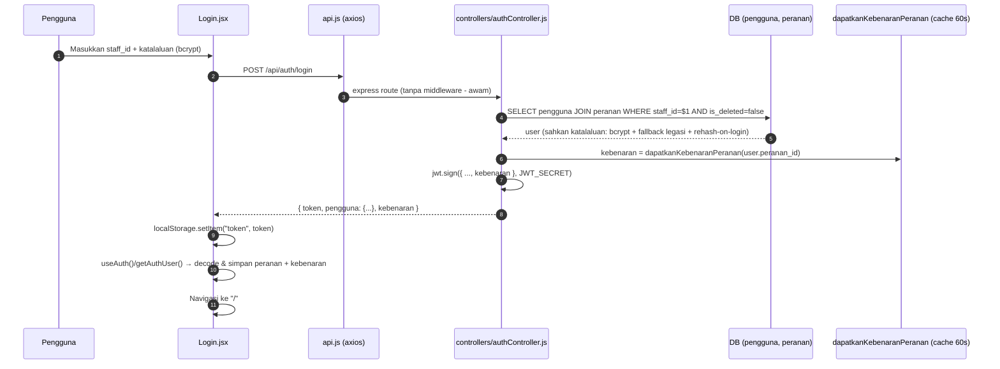
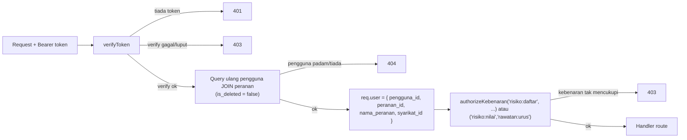

# 01 — Autentikasi & RBAC (Matrix Kebenaran — pos-Revamp v2)

## Tujuan

Aliran log masuk, pengekalan sesi JWT di klien, validasi token di server, dan
penguatkuasaan **kebenaran (permission-based)** + isolasi data ke seluruh sistem.
Selepas Revamp v2 (Fasa 3 & 4), sistem berpindah dari `authorizeRoles` (nama
peranan) kepada matrix `kebenaran` / `peranan_kebenaran` sebagai **satu sumber
kebenaran**.

## Aliran Log Masuk

**Endpoint**: `POST /api/auth/login` (awam, tiada `verifyToken`);
`POST /api/auth/logout` dan `PUT /api/auth/tukar-katalaluan` (dilindungi `verifyToken`).
**Fail**: `risk_frontend/src/pages/Login/Login.jsx`,
`risk_backend/controllers/authController.js`, `risk_backend/routes/auth.js`,
`risk_backend/utils/katalaluan.js`.

## Sesi di Klien

- `src/api/api.js` — satu instans axios `baseURL: VITE_API_URL || http://localhost:5001/api`;
  interceptor permintaan menambah `Authorization: Bearer <localStorage.token>`.
- `src/hooks/useAuth.js` —
  - `getAuthUser()` decode JWT (jwt-decode), semak `exp`, padam token jika luput;
    kini membaca **array `kebenaran`** dari token (`decoded.kebenaran`).
  - **Matrix kebenaran tunggal**: `MATRIX_KEBENARAN` (fallback untuk token lama)
    laluan bagi helper `hasKebenaran(...)` / `getKebenaran()`:
    - `isAdmin()` = `hasKebenaran("pengguna:urus")`
    - `canEditPenilaian()` = `hasKebenaran("risiko:nilai")`
    - `canEdit()` = `hasKebenaran("risiko:daftar")`
    - `canViewTindakan()` & `isRestrictedRole()` kekal berasaskan peranan
      (semantik skop tindakan & isolasi syarikat).
- `src/utils/auth.js` — re-export penuh (termasuk `hasKebenaran`/`getKebenaran`)
  untuk keserasian import lama.
- `components/ProtectedRoute.jsx` — bungkus semua laluan kecuali `/login`
  dan `/unauthorized`; periksa `allowedRoles`.
- `components/AppLayout.jsx` — sidebar/navbar mengikut peranan & kebenaran;
  navbar memuatkan profil (`/users/me`) dan notifikasi (`/notifikasi/*`).

## Validasi di Backend (`middleware/authMiddleware.js`)

- `verifyToken` kini **menapis pengguna `is_deleted=true`** (pengguna dipadam
  tidak boleh kekal beraksi walaupun token sah).
- `dapatkanKebenaranPeranan(perananId)` — query join `peranan_kebenaran`,
  **cache dalam proses selama 60 saat** (elak query setiap permintaan).
- `authorizeKebenaran(...namaKebenaran)` — LULUS jika pengguna memiliki **sekurang-
  kurangnya SATU** daripada senarai (OR). Untuk keperluan "mesti ada SEMUA",
  hantar secara berasingan seperti `authorizeKebenaran("a"), authorizeKebenaran("b")`.
- `authorizeRoles(...)` **kekal dieksport** (fallback) tetapi **tidak lagi digunakan**
  pada mana-mana route aplikasi.

## Matriks Kebenaran (17) — nyahtetapkan semasa log masuk

| Kebenaran | Admin | Executive | KT. Subsidiari | Staff | Viewer |
|-----------|:---:|:---:|:---:|:---:|:---:|
| `risiko:daftar` | ✔ | ✔ | ✔ | ✔ | — |
| `risiko:lihat` | ✔ | ✔ | ✔* | ✔* | ✔ |
| `risiko:nilai` | ✔ | ✔ | ✔* | — | — |
| `risiko:lulus` | ✔ | ✔ | — | — | — |
| `risiko:padam` | ✔ | ✔ | ✔* | — | — |
| `rawatan:urus` | ✔ | ✔ | ✔* | ✔* | — |
| `pemantauan:urus` | ✔ | ✔ | ✔* | ✔* | — |
| `pindaan:urus` | ✔ | ✔ | ✔* | ✔* | — |
| `pindaan:lihat` | ✔ | ✔ | — | — | — |
| `pindaan:lulus` | ✔ | ✔ | — | — | — |
| `pengguna:urus` | ✔ | — | — | — | — |
| `log:baca` | ✔ | ✔ | ✔ | ✔ | ✔ |
| `log:padam` | ✔ | — | — | — | — |
| `notifikasi:urus` | ✔ | ✔ | ✔ | ✔ | ✔ |
| `laporan:jana` | ✔ | ✔ | ✔ | ✔ | ✔ |
| `dashboard:lihat` | ✔ | ✔ | ✔ | ✔ | ✔ |
| `rujukan:urus` | ✔ | ✔ | ✔ | ✔ | — |

\* Skop terhad `syarikat_id` sendiri — kekalkan klausa `WHERE syarikat_id`.
Jumlah kebenaran disahkan dalam spec E2E `01` (Admin 17, Executive 14,
Ketua Subsidiari 11, Staff 9, Viewer 5).

## Isolasi Data (kekal)

**Isolasi dalam query**: `dashboard.js`, `risiko.js`, `rawatan.js`, `pemantauan.js`,
`laporan.js`, `pindaan.js` menambah `WHERE syarikat_id = req.user.syarikat_id`
bila `nama_peranan` termasuk Staff/Ketua Subsidiari, dan kini turut menapis
`is_deleted = false` di peringkat asas.

## Nota / Gotcha

- Kata laluan kini **bcrypt** (`utils/katalaluan.js`): `sahkanKatalaluan`
  menyokong bcrypt + fallback plain-text legasi serta **rehash-on-login**
  (kata laluan legasi ditukar ke bcrypt pada log masuk berikut).
- `kebenaran` dibawa dalam JWT (token >616 aksara). Token lama tanpa `kebenaran`
  → frontend jatuh ke `MATRIX_KEBENARAN` mengikut peranan.
- `pengguna_id` dalam token mungkin `decoded.id` atau `decoded.pengguna_id`;
  `getAuthUser()` mengendalikan kedua-duanya.
- Peranan Title Case di server, UPPERCASE di klien (`ROLE_MAPPING`).
- `pindaan:lihat` (Admin+Executive sahaja) wujud supaya senarai pindaan tidak
  bocor rentas-syarikat kepada Staff/Ketua Subsidiari.