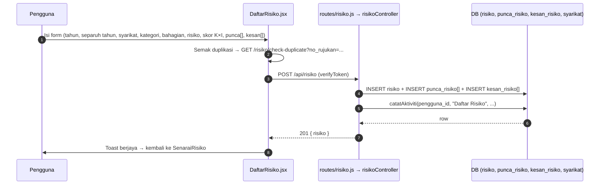

# 02 — Risiko: Daftar & Senarai

## Tujuan

Daftar risiko baharu (pengenalpastian → penilaian → status) dan senarai risiko
yang boleh ditapis, diedit, diluluskan/ditolak, dan dipadam.

## Aliran Daftar Risiko

**Endpoint terlibat** (semua `verifyToken`):

| Kaedah | Laluan | Guna |
|--------|--------|------|
| POST | `/api/risiko/` | Daftar risiko baru (pengenalpastian + penilaian) |
| GET | `/api/risiko/` | Senarai risiko (tapis: `tugasan=true`, `syarikat_id`, tahun, dll.) |
| GET | `/api/risiko/tahun` | Tahun tersedia (juga `routes/tahun.js`) |
| GET | `/api/risiko/check-no-rujukan/:noRujukan` | Semak no. rujukan |
| GET | `/api/risiko/check-duplicate` | Semak duplikasi sebelum daftar |
| GET | `/api/risiko/:risiko_id/rawatan` | Rawatan bagi risiko |
| PUT | `/api/risiko/:risiko_id` | Kemas kini (penilaian, pengenalpastian, rawatan, log) |
| PUT | `/api/risiko/:risiko_id/pemantauan/log/:log_id` | Kemas kini log pemantauan |
| PUT | `/api/risiko/:risiko_id/approve` | Lulus (Admin/Executive, `authorizeRoles`) |
| PUT | `/api/risiko/:risiko_id/reject` | Tolak (Admin/Executive) |
| DELETE | `/api/risiko/:risiko_id` | Padam (Admin) |

**Fail frontend**: `DaftarRisiko/DaftarRisiko.jsx`, `SenaraiRisiko/*`:

| Halaman/Komponen | API |
|------------------|-----|
| `SenaraiRisiko.jsx` | GET `/risiko` (hook `useRisks`), DELETE `/risiko/:id`; klik baris → modal `/risiko/:id` |
| `ButiranRisiko/ModalButiranRisiko.jsx` + `ButiranRisiko.jsx` (`/risiko/:id?tab=&sunting=1`) | GET `/risiko/:risiko_id`, GET `/pemantauan-risiko/:id/sejarah`, GET `/pindaan/risiko/:id`, GET `/log_aktiviti?carian=<no_rujukan>` (tab Sejarah → `TabSejarah.jsx`, garis masa ikut tarikh) |

**Butiran sebagai modal**: `/risiko/:id` tiada halaman sendiri. `App.jsx` (`LaluanAplikasi`) memaparkan halaman latar daripada `location.state.latar` (atau Senarai Risiko bagi pautan terus/muat semula) dan `ModalButiranRisiko` di atasnya. Buka risiko melalui `useBukaRisiko()` / `stateLatar()` (`hooks/useBukaRisiko.js`); tukar tab mengekalkan `state`. Selepas simpan, `maklumkanRisikoBerubah()` memuat semula senarai latar (`useRisikoBerubah`). Klik di luar tidak menutup modal (elak kehilangan borang); tutup = X / Escape / Back.
| `components/risiko/BorangPengenalpastian.jsx` | PUT `/risiko/:risiko_id` (payload penuh `payloadKemaskiniRisiko`) |
| `components/risiko/BorangPenilaian.jsx` | Penilaian pertama sahaja: PUT `/rawatan/penilaian/:id` (pindaan melalui `BorangPindaan`, lihat 05-pindaan) |

### Halaman butiran risiko (revamp UI, `11-PLAN-ui-revamp.md`)

- Pengepala ringkasan (No. rujukan, tahap semasa, status kelulusan) +
  **stepper** Daftar → Kelulusan → Penilaian → Rawatan → Pemantauan
  (`kiraPeringkat` dalam `components/risiko/data.js`) + "Tindakan seterusnya".
- Tab Ringkasan · Penilaian · Rawatan · Pemantauan · Sejarah; sunting dalam tab
  (`?sunting=1`), log pemantauan sebagai garis masa + panel sisi.
- Pinda terus (pengenalpastian, penilaian, rawatan sedia ada, semua log) =
  `pindaan:lulus` (Admin/Executive). Penilaian pertama = `risiko:nilai` atau
  `rawatan:urus`; rawatan pertama = `rawatan:urus`; log = `pemantauan:urus`
  (bukan Admin/Executive: log terkini sahaja; tanpa `risiko:nilai`: status &
  catatan sahaja). Padam log = Admin/Executive.
- `PUT /risiko/:id` menulis semula semua medan — sentiasa guna
  `payloadKemaskiniRisiko` (borang lama menghantar `syarikat` bukan
  `syarikatId` dan gagal).

## Pengasingan Syarikat

`PUT/DELETE /api/risiko/:risiko_id`, `GET/PUT /:risiko_id/rawatan` dan
`PUT /:risiko_id/pemantauan/log/:log_id` dilindungi `hadSyarikat(...)`
(`middleware/aksesSyarikat.js`): Staff & Ketua Subsidiari `403` untuk risiko
syarikat lain. Daftar risiko (`POST`) menyemak `syarikatId` dalam controller.

## Skor & Status Risiko

- `skor_kebarangkalian` (1–5) × `skor_impak` (1–5) → `skor_risiko` =
  **R**endah /*S**ederhana / **T**inggi / **ST**inggi (sangat tinggi).
  Matriks: `src/constants/riskMatrix.js` (klien) & `utils/matriksRisiko.js`
  (`kiraTahapRisiko`, server — dikongsi risiko/pemantauan/pindaan).
- `status_risiko` (string) digunakan dalam aliran kelulusan & SENARAI TUGASAN
  (`?tugasan=true`).

## Kelulusan Risiko

- `SenaraiTugasan.jsx` memanggil `GET /risiko?tugasan=true` (dan
  `GET /pindaan?tugasan=true`).
- `components/risiko/PanelKelulusan.jsx` (drawer) → `PUT /risiko/:id/approve`;
  reject `PUT /risiko/:id/reject` dengan `{ sebab }` (wajib). Butang hanya bagi
  pemegang `risiko:lulus`.
- Tab Ringkasan memaparkan Didaftarkan oleh/Tarikh daftar dan Diluluskan (atau
  Ditolak) oleh/pada daripada `diluluskan_oleh` & `tarikh_kelulusan`.

## Jadual DB Disentuh

`risiko` (PK `risiko_id`, FK `syarikat_id`, `created_by`), `punca_risiko`
(`risiko_id`, `punca`), `kesan_risiko` (`risiko_id`, `kesan`), `syarikat`,
`log_aktiviti` (audit).

## RBAC

| Tindakan | Admin | Executive | Ketua Subsidiari | Staff | Viewer |
|----------|-------|-----------|------------------|-------|--------|
| Lihat (semua syarikat) | ✔ | ✔ | ✘ (syarikat sendiri) | ✘ (syarikat sendiri) | ✔ |
| Daftar / Edit | ✔ | ✔ | ✔ (sendiri) | ✔ (sendiri) | ✘ |
| Lulus / Tolak | ✔ | ✔ | ✘ | ✘ | ✘ |
| Padam | ✔ | ✘ | ✘ | ✘ | ✘ |

## Nota / Gotcha

- `routes/tahun.js` dan beberapa query merujuk jadual `daftar_risiko`, manakala
  migrasi skema mencipta `risiko` — percanggahan nama yang perlu diawasi.
- Admin Auto-Lulus tidak terpakai di sini; kelulusan risiko manual oleh
  Admin/Executive.
- Isolasi data: query `risiko` mesti guna `syarikat_id` dari `req.user` untuk
  Staff/Ketua Subsidiari.