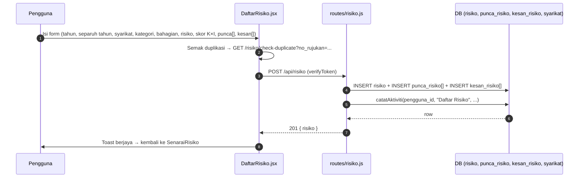

# 02 — Risiko: Daftar & Senarai

## Tujuan

Daftar risiko baharu (pengenalpastian → penilaian → status) dan senarai risiko
yang boleh ditapis, diedit, diluluskan/ditolak, dan dipadam.

## Aliran Daftar Risiko

**Endpoint terlibat** (semua `verifyToken`):

| Kaedah | Laluan | Guna |
|--------|--------|------|
| POST | `/api/risiko/` | Daftar risiko baru (pengenalpastian + penilaian) |
| GET | `/api/risiko/` | Senarai risiko (tapis: `tugasan=true`, `syarikat_id`, tahun, dll.) |
| GET | `/api/risiko/tahun` | Tahun tersedia (juga `routes/tahun.js`) |
| GET | `/api/risiko/check-no-rujukan/:noRujukan` | Semak no. rujukan |
| GET | `/api/risiko/check-duplicate` | Semak duplikasi sebelum daftar |
| GET | `/api/risiko/:risiko_id/rawatan` | Rawatan bagi risiko |
| PUT | `/api/risiko/:risiko_id` | Kemas kini (penilaian, pengenalpastian, rawatan, log) |
| PUT | `/api/risiko/:risiko_id/pemantauan/log/:log_id` | Kemas kini log pemantauan |
| PUT | `/api/risiko/:risiko_id/approve` | Lulus (Admin/Executive, `authorizeRoles`) |
| PUT | `/api/risiko/:risiko_id/reject` | Tolak (Admin/Executive) |
| DELETE | `/api/risiko/:risiko_id` | Padam (Admin) |

**Fail frontend**: `DaftarRisiko/DaftarRisiko.jsx`, `SenaraiRisiko/*`:

| Halaman/Komponen | API |
|------------------|-----|
| `SenaraiRisiko.jsx` | GET `/risiko` (hook `useRisks`), DELETE `/risiko/:id` |
| `PengenalpastianModal.jsx` | GET `/syarikat`, PUT `/risiko/:risiko_id` |
| `PenilaianRisikoModal.jsx` | PUT `/risiko/:risiko_id` (skor K×I → R/S/T/ST) |
| `ViewRisikoModal.jsx` | GET `/risiko`, GET `/pemantauan-risiko/:id/sejarah`, DELETE `/pemantauan-risiko/log/:log_id` |
| `kemaskinirawatan.jsx` | GET `/risiko/:risiko_id/rawatan`, PUT (url dinamik) |
| `KemaskiniPemantauan.jsx` | GET `/pemantauan-risiko/:id/info`, `/tahap-rujukan`, PUT |

## Skor & Status Risiko

- `skor_kebarangkalian` (1–5) × `skor_impak` (1–5) → `skor_risiko` =
  **R**endah /*S**ederhana / **T**inggi / **ST**inggi (sangat tinggi).
  Matriks: `src/constants/riskMatrix.js` (klien) & `routes/risiko.js` (server).
- `status_risiko` (string) digunakan dalam aliran kelulusan & SENARAI TUGASAN
  (`?tugasan=true`).

## Kelulusan Risiko

- `SenaraiTugasan.jsx` memanggil `GET /risiko?tugasan=true` (dan
  `GET /pindaan?tugasan=true`).
- `SenaraiTugasanDetailModal.jsx` → `PUT /risiko/:id/approve` (hantar body
  {sebab}/{komen} bila reject) — butang hanya untuk ADMIN/EXECUTIVE
  (`canEditPenilaian`).
- Reject: `PUT /risiko/:id/reject` dengan `{ sebab: adminComment }`.

## Jadual DB Disentuh

`risiko` (PK `risiko_id`, FK `syarikat_id`, `created_by`), `punca_risiko`
(`risiko_id`, `punca`), `kesan_risiko` (`risiko_id`, `kesan`), `syarikat`,
`log_aktiviti` (audit).

## RBAC

| Tindakan | Admin | Executive | Ketua Subsidiari | Staff | Viewer |
|----------|-------|-----------|------------------|-------|--------|
| Lihat (semua syarikat) | ✔ | ✔ | ✘ (syarikat sendiri) | ✘ (syarikat sendiri) | ✔ |
| Daftar / Edit | ✔ | ✔ | ✔ (sendiri) | ✔ (sendiri) | ✘ |
| Lulus / Tolak | ✔ | ✔ | ✘ | ✘ | ✘ |
| Padam | ✔ | ✘ | ✘ | ✘ | ✘ |

## Nota / Gotcha

- `routes/tahun.js` dan beberapa query merujuk jadual `daftar_risiko`, manakala
  migrasi skema mencipta `risiko` — percanggahan nama yang perlu diawasi.
- Admin Auto-Lulus tidak terpakai di sini; kelulusan risiko manual oleh
  Admin/Executive.
- Isolasi data: query `risiko` mesti guna `syarikat_id` dari `req.user` untuk
  Staff/Ketua Subsidiari.