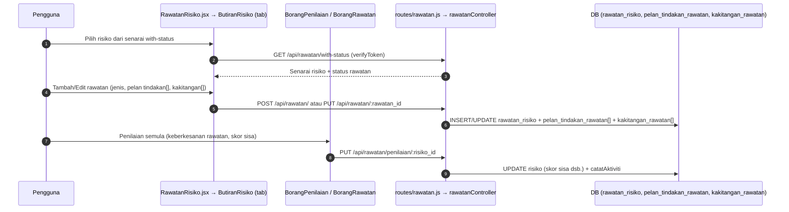

# 03 — Rawatan Risiko

## Tujuan

Urus rawatan/kawalan risiko (Terima, Kurang, Elak, Pindah) berserta pelan
tindakan dan kakitangan yang ditugaskan, serta penilaian semula keberkesanan.

## Aliran

## Endpoint (`routes/rawatan.js` → `controllers/rawatanController.js`, semua `verifyToken`)

> **Pengasingan syarikat**: endpoint ikut ID (risiko/rawatan/log) dilindungi
> `hadSyarikat(...)` (`middleware/aksesSyarikat.js`) — Staff & Ketua Subsidiari
> menerima `403` untuk rekod syarikat lain. Dikawal oleh spec E2E `12-isolasi-syarikat`.

| Kaedah | Laluan | Guna |
|--------|--------|------|
| GET | `/api/rawatan/` | Senarai rawatan (rasmi) |
| GET | `/api/rawatan/with-status` | Senarai risiko + status rawatan (halaman utama) |
| GET | `/api/rawatan/:risiko_id` | Rawatan bagi sesuatu risiko |
| POST | `/api/rawatan/` | Tambah rawatan + pelan tindakan + kakitangan |
| PUT | `/api/rawatan/:rawatan_id` | Edit rawatan |
| DELETE | `/api/rawatan/:rawatan_id` | Padam rawatan |
| PUT | `/api/rawatan/penilaian/:risiko_id` | Penilaian semula/keberkesanan rawatan |

**Fail frontend**: `RawatanRisiko/*`:

| Halaman/Komponen | API |
|------------------|-----|
| `RawatanRisiko.jsx` | GET `/rawatan/with-status` (risiko aktif & diluluskan sahaja; status log terkini) |
| `components/risiko/AliranKerjaRisiko.jsx` | GET `/pemantauan-risiko` — jalur aliran 1 Perlu Dinilai → 2 Perlu Rawatan → 3 Dalam Pemantauan → 4 Selesai (kiraan ikut `peringkatAliran()` dalam `components/risiko/data.js`) |
| `components/risiko/BorangRawatan.jsx` | GET `/rawatan/:risiko_id`; tiada rekod → POST `/rawatan`, ada → PUT `/rawatan/:rawatan_id` |
| `components/risiko/BorangPenilaian.jsx` | PUT `/rawatan/penilaian/:risiko_id` (penilaian pertama; set status pemantauan sesi "Sedang Dilaksanakan") |

`RawatanRisiko.jsx` (Penilaian & Rawatan) = langkah 1 & 2 jalur aliran (`?tab=penilaian|rawatan`); butang "Nilai"/"Rawat" membuka `/risiko/:id?tab=penilaian|rawatan&sunting=1`. Jadual padat pada desktop, kad pada telefon, 20 rekod setiap halaman.

## Jenis Rawatan

Strategi kawalan risiko lazim: **Terima** (accept), **Kurang** (mitigate),
**Elak** (avoid), **Pindah** (transfer). Setiap rawatan boleh membawa
`pelan_tindakan_rawatan[]` (langkah spesifik) dan `kakitangan_rawatan[]`
(penjawat yang bertanggungjawab).

## Jadual DB Disentuh

`rawatan_risiko` (FK `risiko_id`), `pelan_tindakan_rawatan` (FK `rawatan_id`),
`kakitangan_rawatan` (FK `rawatan_id` / pengguna), `risiko` (kemas kini skor
sisa / penilaian), `log_aktiviti`.

## RBAC

| Tindakan | Admin | Executive | Ketua Subsidiari | Staff | Viewer |
|----------|-------|-----------|------------------|-------|--------|
| Lihat | ✔ | ✔ | ✔ (sendiri) | ✔ (sendiri) | ✔ |
| Tambah/Edit/Padam rawatan | ✔ | ✔ (penilaian) | ✔ (sendiri) | ✔ (sendiri) | ✘ |
| Penilaian semula | ✔ | ✔ | ✘ | ✘ | ✘ |

`canEditPenilaian()` di klien = ADMIN/EXECUTIVE sahaja.

## Nota / Gotcha

- Penilaian semula dikira kesan kepada skor risiko — pastikan pengiraan skor
  kekal konsisten dengan `riskMatrix` (klien) / `utils/matriksRisiko.js` (server).
- Data isolation dikenakan untuk Staff/Ketua Subsidiari pada query `rawatan_risiko`.