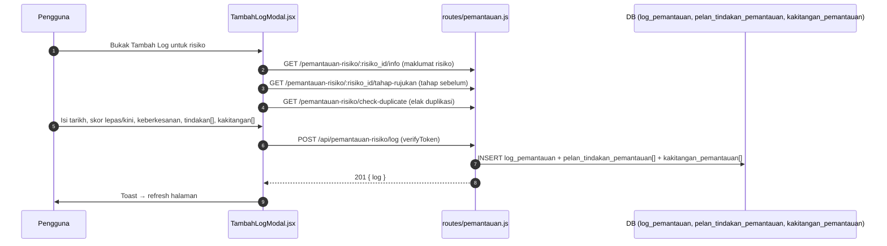

# 04 — Pemantauan Risiko

## Tujuan

Penjejakan berkala keberkesanan rawatan terhadap risiko melalui **log
pemantauan**, perbandingan tahap risiko, dan sejarah pemantauan.

## Aliran Tambah Log Pemantauan

## Endpoint (`routes/pemantauan.js`, semua `verifyToken`)

| Kaedah | Laluan | Guna |
|--------|--------|------|
| GET | `/api/pemantauan-risiko/` | Senarai pemantauan (ringkasan) |
| GET | `/api/pemantauan-risiko/:risiko_id/info` | Info risiko untuk log |
| GET | `/api/pemantauan-risiko/:risiko_id/sejarah` | Sejarah log pemantauan sesuatu risiko |
| GET | `/api/pemantauan-risiko/:risiko_id/sejarah-baru` | Sejarah versi terkini |
| GET | `/api/pemantauan-risiko/:risiko_id/tahap-rujukan` | Tahap risiko sebelum/semasa |
| GET | `/api/pemantauan-risiko/check-duplicate` | Semak duplikasi log |
| POST | `/api/pemantauan-risiko/log` | Tambah log pemantauan |
| PUT | `/api/pemantauan-risiko/log/:log_id` | Edit log |
| DELETE | `/api/pemantauan-risiko/log/:log_id` | Padam log |

**Fail frontend**:

| Halaman/Komponen | API |
|------------------|-----|
| `PemantauanRisiko.jsx` | GET `/pemantauan-risiko`, GET `/syarikat`, GET `/rawatan/:risiko_id` |
| `TambahLogModal.jsx` | GET `/:id/info`, `/:id/tahap-rujukan`, `/check-duplicate`, POST `/log` |
| `EditPemantauan.jsx` | GET `/:id/sejarah`, DELETE `/log/:log_id` |
| `SenaraiRisiko/KemaskiniPemantauan.jsx` | GET `/:id/info`, `/:id/tahap-rujukan`, PUT `/risiko/:risiko_id/pemantauan/log/:log_id` |
| `SenaraiRisiko/ViewRisikoModal.jsx` | GET `/:id/sejarah`, DELETE `/log/:log_id` |

## Konsep Utama

- **Tahap rujukan**: tahap risiko "sebelum" dipaparkan sebagai rujukan; log baru
  merekod skor/tahap kini dan **keberkesanan** rawatan.
- **Sejarah**: garis masa log bagi risiko; boleh dizoom dari mana-mana halaman
  (`sejarah`, `sejarah-baru`).
- Prefix penuh ialah `/api/pemantauan-risiko` (dash), bukan underscore.

## Jadual DB Disentuh

`logpemantauan` (FK `risiko_id`, skor lepas/kini, keberkesanan),
`pelantindakanpemantauan`, `kakitanganpemantauan`, `risiko`, `log_aktiviti`.

## RBAC

| Tindakan | Admin | Executive | Ketua Subsidiari | Staff | Viewer |
|----------|-------|-----------|------------------|-------|--------|
| Lihat | ✔ | ✔ | ✔ (sendiri) | ✔ (sendiri) | ✔ |
| Tambah/Edit/Padam log | ✔ | ✔ | ✔ (sendiri) | ✔ (sendiri) | ✘ |

## Nota / Gotcha

- Nama jadual dalam migrasi Knex ialah `logpemantauan`,
  `pelantindakanpemantauan`, `kakitanganpemantauan` (bersambung) — setara dengan
  `log_pemantauan`, `pelan_tindakan_pemantauan`, `kakitangan_pemantauan` dalam
  dokumentasi README.
- `PUT /risiko/:risiko_id/pemantauan/log/:log_id` (routes/risiko.js) digunakan
  oleh KemaskiniPemantauan untuk update log dari dalam Senarai Risiko.