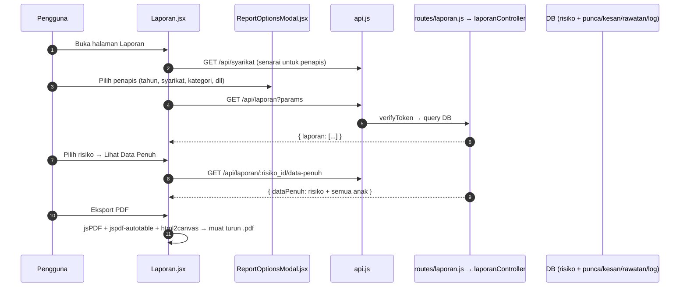

# 06 — Laporan & PDF

## Tujuan

Penjanaan laporan risiko (senarai / laporan penuh per risiko) dengan penapis
maju, dan eksport ke PDF di sisi klien menggunakan **jsPDF**.

## Aliran

## Endpoint (`routes/laporan.js` → `controllers/laporanController.js`, semua `verifyToken`)

| Kaedah | Laluan | Guna |
|--------|--------|------|
| GET | `/api/laporan/` | Senarai laporan ringkas dengan penapis (`params`: tahun, syarikat, kategori, dll.) |
| GET | `/api/laporan/:risiko_id/data-penuh` | Data lengkap satu risiko untuk laporan penuh |

**Fail frontend** (`Laporan/*`):

| Komponen | API |
|----------|-----|
| `Laporan.jsx` | GET `/syarikat`, GET `/laporan` (params), GET `/laporan/:id/data-penuh` |
| `ReportOptionsModal.jsx` | Pemilihan penapis & jenis laporan |
| `LogPreviewModal.jsx` | Pratinjau log pemantauan dalam laporan |

## Penjanaan PDF

- **jsPDF** (`jspdf`) + **jspdf-autotable** + **html2canvas** dihasilkan
  sepenuhnya di browser (tiada endpoint PDF berasingan).
- Semua data diperoleh dulu dari API kemudian di-render ke PDF.

## Jadual DB Disentuh

`risiko`, `punca_risiko`, `kesan_risiko`, `rawatan_risiko`, `logpemantauan`
(dan lain-lain pilihan), `syarikat`.

## RBAC

| Tindakan | Admin | Executive | Ketua Subsidiari | Staff | Viewer |
|----------|-------|-----------|------------------|-------|--------|
| Lihat laporan | ✔ | ✔ (semua syarikat) | ✔ (sendiri) | ✔ (sendiri) | ✔ |
| Eksport PDF | ✔ | ✔ | ✔ | ✔ | ✔ |

## Nota / Gotcha

- Data laporan tertakluk pada isolasi data sisi server (Staff/Ketua Subsidiari
  hanya syarikat sendiri).
- PDF dijana di klien; pastikan font/pengaturcaraan autotable konsisten untuk
  teks Bahasa Melayu (unicode).