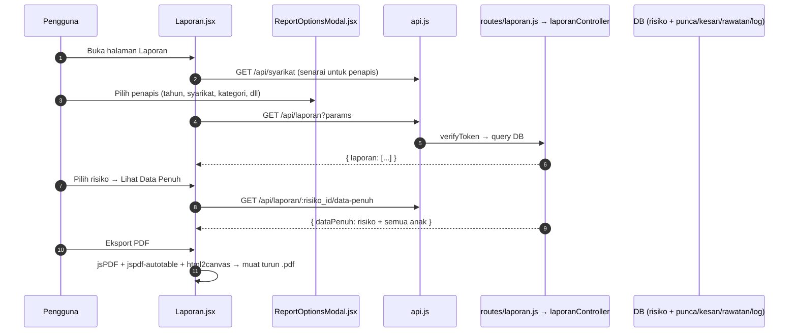

# 06 — Laporan & PDF

## Tujuan

Halaman Laporan mempunyai dua tab (`?paparan=pdf` untuk tab kedua):

1. **Analitik** (lalai) — dashboard perbandingan separuh tahun, syarikat,
   kategori dan keberkesanan rawatan, dengan tapisan dan mod skrin penuh.
2. **Jana Laporan PDF** — senarai risiko yang telah mempunyai rawatan dan
   eksport laporan penuh per risiko ke PDF di sisi klien (**jsPDF**).

## Aliran

## Endpoint (`routes/laporan.js` → `controllers/laporanController.js`, semua `verifyToken`)

> **Pengasingan syarikat**: senarai ditapis dalam controller; `data-penuh`
> dilindungi `hadSyarikat` (Staff/Ketua Subsidiari `403` untuk risiko syarikat lain).

| Kaedah | Laluan | Guna |
|--------|--------|------|
| GET | `/api/laporan/` | Senarai laporan ringkas dengan penapis (`params`: tahun, syarikat, kategori, dll.) |
| GET | `/api/laporan/analitik` | Data mentah analitik: `{ risiko, pemantauan, syarikat }` (tahap awal per risiko, skor/keberkesanan per log). Staff/Ketua Subsidiari hanya syarikat sendiri |
| GET | `/api/laporan/:risiko_id/data-penuh` | Data lengkap satu risiko untuk laporan penuh |

**Fail frontend** (`Laporan/*`):

| Komponen | API |
|----------|-----|
| `Laporan.jsx` | Tab Analitik / Jana Laporan PDF; GET `/syarikat`, GET `/laporan` (params), GET `/laporan/:id/data-penuh` |
| `AnalitikLaporan.jsx` | GET `/laporan/analitik`; carta Recharts, tapisan, jadual, skrin penuh |
| `analitik.js` | Agregasi di klien (tahap pada akhir separuh tahun, perbandingan syarikat/kategori, keberkesanan) |
| `ReportOptionsModal.jsx` | Pemilihan penapis & jenis laporan |
| `LogPreviewModal.jsx` | Pratinjau log pemantauan dalam laporan |

## Analitik

- **Tahap pada akhir separuh tahun** = skor log pemantauan terkini sehingga
  tempoh itu; jika tiada log, penilaian awal (`risiko.skor_risiko`); tiada
  kedua-duanya = "Belum Dinilai". Risiko dikira mulai tempoh ia didaftar.
- Carta: profil tahap ikut separuh tahun, profil tahap ikut syarikat, risiko
  baharu ikut syarikat (garis), keberkesanan (Berkesan/Tidak), kategori ikut
  tahap. Setiap carta ada petunjuk warna, tooltip dan paparan jadual.
- Warna tahap risiko = warna domain sistem (`getRiskColor`); warna syarikat =
  palet kategori tetap 8 slot (warna ikut syarikat, bukan kedudukan; slot ke-9+
  dilipat ke "Lain-lain"). Tiada paksi berganda.
- Tapisan (satu baris di atas carta): syarikat, kategori, julat separuh tahun;
  semua carta & statistik mengikut tapisan yang sama.

## Penjanaan PDF

- **jsPDF** (`jspdf`) + **jspdf-autotable** + **html2canvas** dihasilkan
  sepenuhnya di browser (tiada endpoint PDF berasingan).
- Semua data diperoleh dulu dari API kemudian di-render ke PDF.
- Gaya rasmi ikut format surat rasmi kerajaan: fon Helvetica (setara metrik
  Arial; Arial tidak boleh dibundel tanpa lesen) dengan satu skala saiz
  (`SAIZ`), rangka hitam-putih, pengepala & kaki muka surat "SULIT". Logo UKM
  Holdings dengan "Unit Pematuhan dan Pengurusan Risiko" dua baris di bawahnya
  (saiz fon dikira supaya selebar logo). **Satu-satunya warna ialah sel tahap
  risiko** (warna sistem, sentiasa berlabel "Tinggi (T)"); tiada jadual petunjuk.
  Sesi ditulis "Separuh Tahun Pertama/Kedua".
- UI: `ReportOptionsModal` (Dialog; keseluruhan / khusus: satu sesi, julat,
  pemantauan sahaja) -> `LogPreviewModal` (Dialog hampir penuh skrin; PDF dibuka
  muat lebar: `#view=FitH,0`, Edge `#zoom=page-width`; butang Buka di Tab Baharu
  & Muat Turun `Laporan_<no_rujukan>.pdf`; telefon memaparkan butang buka/muat
  turun kerana pelayar mudah alih tidak memaparkan PDF dalam halaman).
- Setiap log pemantauan = satu jadual 7 lajur (`rowPageBreak: 'avoid'`);
  pindaan penilaian/keberkesanan menjadi baris dalam jadual. Lebar lajur mesti
  dalam mm (`lebar(peratus)`), rentetan peratus diabaikan jspdf-autotable.

## Jadual DB Disentuh

`risiko`, `punca_risiko`, `kesan_risiko`, `rawatan_risiko`, `logpemantauan`
(dan lain-lain pilihan), `syarikat`.

## RBAC

| Tindakan | Admin | Executive | Ketua Subsidiari | Staff | Viewer |
|----------|-------|-----------|------------------|-------|--------|
| Lihat laporan | ✔ | ✔ (semua syarikat) | ✔ (sendiri) | ✔ (sendiri) | ✔ |
| Eksport PDF | ✔ | ✔ | ✔ | ✔ | ✔ |

## Nota / Gotcha

- Data laporan tertakluk pada isolasi data sisi server (Staff/Ketua Subsidiari
  hanya syarikat sendiri).
- PDF dijana di klien; pastikan font/pengaturcaraan autotable konsisten untuk
  teks Bahasa Melayu (unicode).