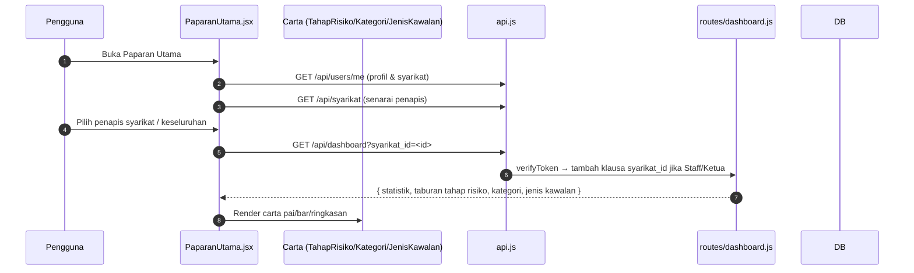

# 07 — Paparan Utama (Dashboard)

## Tujuan

Dashboard statistik risiko dengan carta interaktif (recharts) dan penapis
syarikat, dijana mengikut peranan pengguna (isolasi data).

## Aliran

## Endpoint

| Kaedah | Laluan | Middleware | Guna |
|--------|--------|------------|------|
| GET | `/api/dashboard/` | `verifyToken` (RBAC-filtered) | Statistik dashboard + data carta |

**Fail frontend** (`PaparanUtama/*`):

| Komponen | API |
|----------|-----|
| `PaparanUtama.jsx` | GET `/users/me`, GET `/syarikat`, GET `/dashboard?syarikat_id=` |
| `DashboardKeseluruhan.jsx` | Paparan agregat semua syarikat |
| `DashboardSyarikat.jsx` | Paparan bagi satu syarikat |
| `FilterModal.jsx` | Pemilihan penapis syarikat |
| `TahapRisikoChart.jsx` / `KategoriRisikoChart.jsx` / `JenisKawalanChart.jsx` | Carta recharts |

## Peranan & Isolasi Data

- Admin & Executive: lihat **semua** syarikat (`syarikat_id` parameter
  dihormatkan).
- Staff & Ketua Subsidiari: dashboard memaksa `syarikat_id = req.user.syarikat_id`
  walaupun `syarikat_id` param dihantar (bersama `syarikat.js` dan `risiko.js`).

## Jadual DB Disentuh

`risiko`, `rawatan_risiko`, `syarikat`, `peranan`, `logpemantauan` (untuk
keberkesanan / jenis kawalan bergantung pada agregat).

## Nota / Gotcha

- Dashboard bergantung kepada `req.user` dari `verifyToken` untuk menentukan
  skop data — jangan hapuskan klausa syarikat untuk peranan terhad.
- Carta dikemas kini bila penapis `syarikat_id` berubah; tanpa penapis, paparkan
  keseluruhan (khas untuk Admin/Executive).