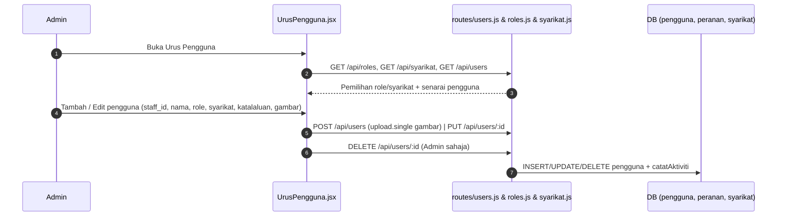

# 08 — Pengguna, Notifikasi & Log Aktiviti

## Tujuan

Mengurus pengguna & profil (Admin), data rujukan (roles, syarikat, bahagian),
mekanik notifikasi merentas modul, dan jejak audit `log_aktiviti`.

## Aliran Urus Pengguna

### Profil Sendiri

- `navbar.jsx` menarik `GET /users/me`; kemaskini profil menerusi
  `PUT /users/me` dengan `upload.single("gambar_profil")` (multer).
- `GET /users/me` & `PUT /users/me` — dibuka kepada semua (verifyToken sahaja).

## Endpoint

| Kaedah | Laluan | Middleware | Modul |
|--------|--------|------------|-------|
| POST | `/api/auth/login` | — (awam) | Auth |
| GET | `/api/users/` | `verifyToken, Admin` | Urus Pengguna |
| GET | `/api/users/me` | `verifyToken` | Profil |
| PUT | `/api/users/me` | `verifyToken, upload` | Profil |
| POST | `/api/users/` | `verifyToken, Admin, upload` | Urus Pengguna |
| PUT | `/api/users/:id` | `verifyToken, Admin, upload` | Urus Pengguna |
| DELETE | `/api/users/:id` | `verifyToken, Admin` | Urus Pengguna |
| GET | `/api/roles/` | `verifyToken, Admin` | Rujukan |
| GET | `/api/syarikat/` | `verifyToken` (RBAC-filtered) | Rujukan |
| GET | `/api/bahagian/` | `verifyToken` | Rujukan |
| POST | `/api/bahagian/` | `verifyToken` | Rujukan (DaftarRisiko tambah bahagian) |
| GET | `/api/log_aktiviti/` | `verifyToken` | Jejak audit |
| DELETE | `/api/log_aktiviti/:id` | `verifyToken, Admin` | Jejak audit |
| DELETE | `/api/log_aktiviti/` | `verifyToken, Admin` | Jejak audit |
| GET | `/api/notifikasi/` | `verifyToken` | Notifikasi |
| GET | `/api/notifikasi/unread-count` | `verifyToken` | Notifikasi |
| PUT | `/api/notifikasi/:notifikasi_id/baca` | `verifyToken` | Notifikasi |
| PUT | `/api/notifikasi/baca-semua` | `verifyToken` | Notifikasi |
| DELETE | `/api/notifikasi/:notifikasi_id` | `verifyToken` | Notifikasi |

## Notifikasi

- **Utiliti**: `utils/notifikasi.js` →
  `hantarNotifikasi(pengguna_id, tajuk, mesej, jenis, entiti_id)`,
  `hantarNotifikasiBulk(pengguna_ids[], ...)`,
  `dapatkanPenggunaIdByPeranan("Admin", ...)`.
- **UI**: `navbar.jsx` — badge unread (`/notifikasi/unread-count`), senarai
  drop-down (`/notifikasi?limit=15`), tandai baca, baca-semua, padam.
- Digunakan dalam pindaan (kepada pelulus & pemohon), kelulusan risiko,
  dan tugasan.

## Log Aktiviti (Jejak Audit)

- **Utiliti**: `utils/catatAktiviti.js` →
  `catatAktiviti(pengguna_id, aktiviti, ringkasan, perincian)` — parameter
  **posisi**, menulis ke `log_aktiviti`, ralat ditekan (hanya log).
- **UI**: `LogAktiviti/LogAktiviti.jsx` — GET `/log_aktiviti` (params tapisan,
  guna role & syarikat filter), GET `/roles`/`/syarikat` untuk penapis, DELETE
  `/log_aktiviti/:id` & DELETE `/log_aktiviti` (Admin).

## Jadual DB Disentuh

`pengguna`, `peranan`, `syarikat`, `bahagian`, `notifikasi`, `log_aktiviti`.

## RBAC

| Tindakan | Admin | Executive | Ketua Subsidiari | Staff | Viewer |
|----------|-------|-----------|------------------|-------|--------|
| Urus pengguna | ✔ | ✘ | ✘ | ✘ | ✘ |
| Lihat/profil sendiri | ✔ | ✔ | ✔ | ✔ | ✔ |
| Padam / lihat log aktiviti | ✔ | ✔ (lihat) | ✔ (lihat) | ✔ (lihat) | ✔ (lihat) |
| Tandai notifikasi | ✔ | ✔ | ✔ | ✔ | ✔ |

## Nota / Gotcha

- **Multer**: muat naik gambar profil guna `upload.single("gambar_profil")` —
  endpoint users memerlukan `multipart/form-data`.
- Panggilan `catatAktiviti({...})` dalam `authController.js` menggunakan objek —
  tidak selari dengan konvensyen parameter posisi utiliti (potensi nilai
  `[object Object]` dalam log).
- `DELETE /log_aktiviti/` (tanpa id) memadam pukal dengan `params` penapis;
  hanya Admin.
- Roles/syarikat dipakai sebagai penapis di LogAktiviti — pastikan senarai
  sentiasa dimuat sebelum paparan.