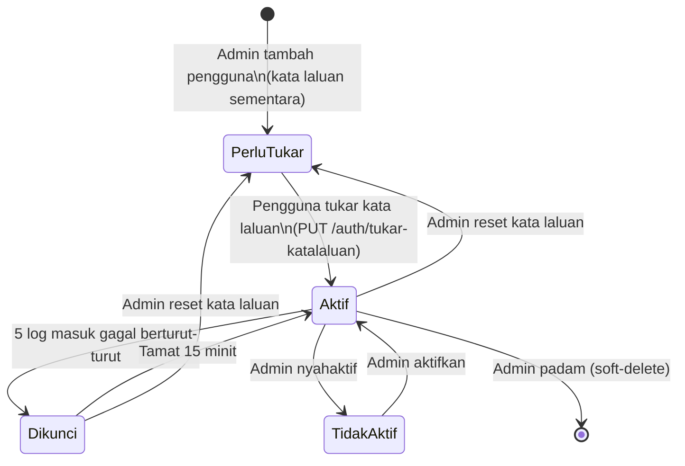

# 08 — Pengguna, Notifikasi & Log Aktiviti

## Tujuan

Mengurus pengguna & profil (Admin), data rujukan (roles, syarikat, bahagian),
mekanik notifikasi merentas modul, dan jejak audit `log_aktiviti`.

## Aliran Urus Pengguna

```mermaid
sequenceDiagram
  autonumber
  participant A as Admin
  participant U as UrusPengguna.jsx
  participant B as routes/users,roles,syarikat → user/peranan/syarikatController
  participant DB as DB (pengguna, peranan, syarikat)

  A->>U: Buka Urus Pengguna
  U->>B: GET /api/roles, GET /api/syarikat, GET /api/users
  B-->>U: Pemilihan role/syarikat + senarai pengguna
  A->>U: Tambah pengguna (staff_id, nama, role, syarikat, [kata laluan sementara], gambar)
  U->>B: POST /api/users (upload.single gambar)
  B-->>U: pengguna + katalaluan_sementara (jika dijana; dipapar SEKALI)
  A->>U: Edit maklumat (tiada medan kata laluan)
  U->>B: PUT /api/users/:id
  A->>U: Tetapkan semula kata laluan / Nyahaktif / Aktifkan / Padam
  U->>B: POST /api/users/:id/reset-katalaluan | PATCH /api/users/:id/status | DELETE /api/users/:id
  B->>DB: INSERT/UPDATE pengguna (padam = soft-delete) + catatAktiviti
```

### Kitaran Hayat Akaun (migrasi 025)



| Lajur `pengguna` | Makna |
|------------------|-------|
| `perlu_tukar_katalaluan` | `true` bagi akaun baharu & selepas reset. `verifyToken` hanya membenarkan `GET /api/users/me`, `PUT /api/auth/tukar-katalaluan`, `POST /api/auth/logout`; laluan lain `403 { kod: "PERLU_TUKAR_KATALALUAN" }` |
| `is_aktif` | `false` = digantung. Login `403` (hanya selepas kata laluan sah), token sedia ada `401` |
| `percubaan_gagal`, `dikunci_hingga` | 5 gagal berturut-turut → dikunci 15 minit (`423`); login berjaya / reset / aktifkan menetapkan semula |
| `log_masuk_terakhir`, `katalaluan_dikemaskini_at` | Paparan pentadbir |

- **Polisi kata laluan** (`semakPolisiKatalaluan` dalam `utils/katalaluan.js`,
  cermin FE `src/constants/katalaluan.js`): ≥8 aksara, ada huruf & nombor, tiada
  ruang kosong, ≤72. Dikuatkuasa setiap kali kata laluan *ditetapkan*;
  kata laluan lama yang lemah masih boleh log masuk.
- **Kata laluan sementara** dijana `janaKatalaluanSementara()` (crypto, 10 aksara
  tanpa 0/O/1/l/I) dan hanya dipulangkan dalam respons tambah/reset.
- Perlindungan akaun sendiri: pentadbir tidak boleh reset kata laluan,
  nyahaktif, padam atau menukar peranan akaun sendiri (`400`).
- Staff & Ketua Subsidiari wajib ada `syarikat_id` (`PERANAN_TERHAD` dari
  `middleware/aksesSyarikat.js`).

- `PUT /api/users/:id` mengemas kini `token_dikemaskini_at = NOW()` jika kata
  laluan (keserasian API; UI guna reset — kata laluan ditetapkan pentadbir menanda
  `perlu_tukar_katalaluan`), `staff_id`, `peranan_id` atau `syarikat_id` berubah → token lama
  pengguna itu dicabut (`401`) dan dia perlu log masuk semula.

### Profil Sendiri

- `navbar.jsx` menarik `GET /users/me`; kemaskini profil menerusi
  `PUT /users/me` dengan `upload.single("gambar_profil")` (multer).
- `GET /users/me` & `PUT /users/me` — dibuka kepada semua (verifyToken sahaja).
- `GET /users/me` memulangkan profil + **array `kebenaran` terkini** (sumber
  kebenaran UI; dimuat semula oleh `AppLayout` pada mount/focus/60s).
- `PUT /users/me` dengan kata laluan baharu (polisi dikuatkuasa) →
  `token_dikemaskini_at` dikemas kini; navbar memadam token dan mengarahkan ke `/login`.
- Halaman `/tukar-katalaluan` (`pages/TukarKatalaluan/`) — di luar `AppLayout`;
  `ProtectedRoute` & interceptor `403 PERLU_TUKAR_KATALALUAN` menghala ke sini.
  `PUT /api/auth/tukar-katalaluan` memulangkan **token baharu** supaya pengguna
  terus ke papan pemuka tanpa log masuk semula.

## Endpoint

| Kaedah | Laluan | Middleware | Modul |
|--------|--------|------------|-------|
| POST | `/api/auth/login` | — (awam) | Auth |
| POST | `/api/auth/logout` | `verifyToken` | Auth |
| PUT | `/api/auth/tukar-katalaluan` | `verifyToken` | Auth (polisi, cabut token lama, pulang token baharu) |
| GET | `/api/users/` | `verifyToken, pengguna:urus` | Urus Pengguna |
| GET | `/api/users/me` | `verifyToken` | Profil + `kebenaran` |
| PUT | `/api/users/me` | `verifyToken, upload` | Profil |
| POST | `/api/users/` | `verifyToken, pengguna:urus, upload` | Urus Pengguna |
| PUT | `/api/users/:id` | `verifyToken, pengguna:urus, upload` | Urus Pengguna |
| POST | `/api/users/:id/reset-katalaluan` | `verifyToken, pengguna:urus` | Urus Pengguna (kata laluan sementara, buka kunci, cabut sesi) |
| PATCH | `/api/users/:id/status` | `verifyToken, pengguna:urus` | Urus Pengguna (`{ is_aktif }`) |
| DELETE | `/api/users/:id` | `verifyToken, pengguna:urus` | Urus Pengguna (soft-delete) |
| GET | `/api/roles/` | `verifyToken, pengguna:urus` | Rujukan |
| POST | `/api/roles/flush-cache` | `verifyToken, pengguna:urus` | Kosongkan cache kebenaran (log aktiviti) |
| GET | `/api/syarikat/` | `verifyToken` (RBAC-filtered) | Rujukan |
| GET | `/api/bahagian/` | `verifyToken` | Rujukan |
| POST | `/api/bahagian/` | `verifyToken, rujukan:urus` | Rujukan (DaftarRisiko tambah bahagian) |
| GET | `/api/log_aktiviti/` | `verifyToken, log:baca` | Jejak audit (Staff/Ketua Subsidiari: syarikat sendiri sahaja) |
| DELETE | `/api/log_aktiviti/:id` | `verifyToken, log:padam` | Jejak audit (soft-delete) |
| DELETE | `/api/log_aktiviti/` | `verifyToken, log:padam` | Jejak audit (soft-delete) |
| GET | `/api/notifikasi/` | `verifyToken` | Notifikasi |
| GET | `/api/notifikasi/unread-count` | `verifyToken` | Notifikasi |
| PUT | `/api/notifikasi/:notifikasi_id/baca` | `verifyToken` | Notifikasi |
| PUT | `/api/notifikasi/baca-semua` | `verifyToken` | Notifikasi |
| DELETE | `/api/notifikasi/:notifikasi_id` | `verifyToken` | Notifikasi |

## Notifikasi

- **Utiliti**: `utils/notifikasi.js` →
  `hantarNotifikasi(pengguna_id, tajuk, mesej, jenis, entiti_id)`,
  `hantarNotifikasiBulk(pengguna_ids[], ...)`,
  `dapatkanPenerimaIkutKebenaran(["pindaan:lulus"], { kecuali: [pelaku] })` —
  penerima ikut kebenaran; fallback `pengguna:urus` bila tiada pemegang.
- **UI**: `navbar.jsx` — badge unread (`/notifikasi/unread-count`), senarai
  drop-down (`/notifikasi?limit=15`), tandai baca, baca-semua, padam.
- Digunakan dalam pindaan (kepada pelulus & pemohon), kelulusan risiko,
  dan tugasan.

## Log Aktiviti (Jejak Audit)

- **Utiliti**: `utils/catatAktiviti.js` →
  `catatAktiviti(pengguna_id, aktiviti, ringkasan, perincian)` — parameter
  **posisi**, menulis ke `log_aktiviti`, ralat ditekan (hanya log).
- **UI**: `LogAktiviti/LogAktiviti.jsx` — GET `/log_aktiviti` (params tapisan,
  guna role & syarikat filter), GET `/roles`/`/syarikat` untuk penapis, DELETE
  `/log_aktiviti/:id` & DELETE `/log_aktiviti` (Admin).

## Jadual DB Disentuh

`pengguna`, `peranan`, `syarikat`, `bahagian`, `notifikasi`, `log_aktiviti`.

## RBAC

| Tindakan | Admin | Executive | Ketua Subsidiari | Staff | Viewer |
|----------|-------|-----------|------------------|-------|--------|
| Urus pengguna | ✔ | ✘ | ✘ | ✘ | ✘ |
| Lihat/profil sendiri | ✔ | ✔ | ✔ | ✔ | ✔ |
| Padam / lihat log aktiviti | ✔ | ✔ (lihat) | ✔ (lihat) | ✔ (lihat) | ✔ (lihat) |
| Tandai notifikasi | ✔ | ✔ | ✔ | ✔ | ✔ |

## Nota / Gotcha

- **Multer**: muat naik gambar profil guna `upload.single("gambar_profil")` —
  endpoint users memerlukan `multipart/form-data`.
- `DELETE /log_aktiviti/` (tanpa id) soft-delete pukal dengan `params` penapis;
  perlu `log:padam` (Admin).
- Roles/syarikat dipakai sebagai penapis di LogAktiviti — pastikan senarai
  sentiasa dimuat sebelum paparan.