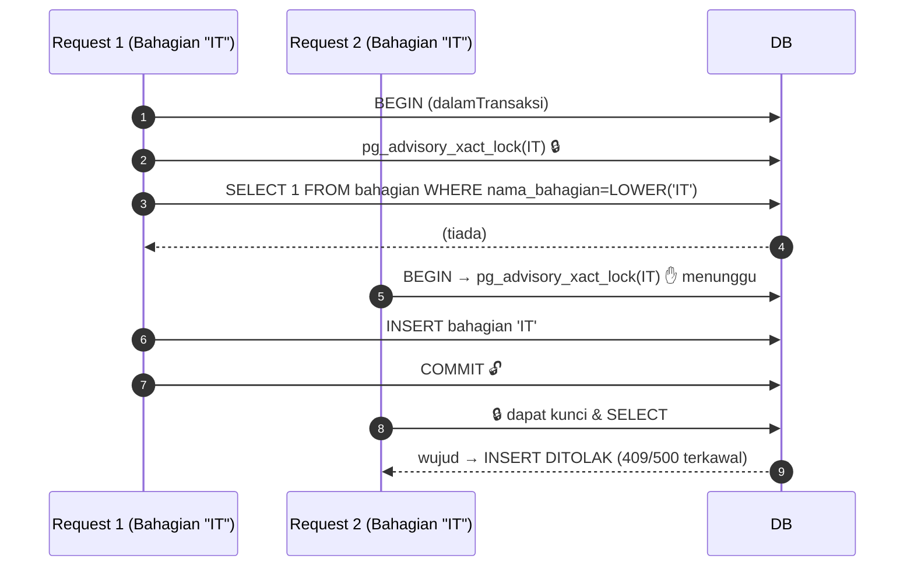

# 10 — PLAN Lanjutan: Aliran Baharu & Skenario (selepas Revamp v2)

> Dekedin-v2 lengkap (Fasa 1–4, 6, 7). Dokumen ini merekod **aliran baharu**
> yang diperkenalkan semasa revamp, **scenario/isu yang belum dikenal pasti
> di awal**, dan cadangan langkah selanjutnya dengan keutamaan (P1/P2/P3).

---

## 1. Aliran baharu yang diperkenalkan (hasil Revamp v2)

### 1.1 Lumba-lumba (race) pada `bahagian` POST — kunci advisory

**Masalah** (Fasa 1): dua permintaan serentak boleh lulus `SELECT` (tidak jumpa)
sebelum sama-sama `INSERT` → pelanggaran `UNIQUE (nama_bahagian)` → ralat 500.

**Penyelesaian**: `pg_advisory_xact_lock(hashtextextended(LOWER($1), 0))` —
kunci dipegang **dalam transaksi sahaja** dan dilepas automatik pada COMMIT/ROLLBACK.
Query dilarikan di dalam `dalamTransaksi`.

**Skenario lanjutan (P2)**: kunci advisory berkesan per-sambungan/transaction;
bagi **berbilang instance aplikasi**, `hashtextextended` menggunakan seed hash
yang sama merentas DB — selamat. Walau bagaimanapun, `LOWER()` hanya normalkan ASCII;
cadang tambah indeks unik expression `UNIQUE (LOWER(nama_bahagian))` sebagai
pelindung kedua.

### 1.2 Rehash-on-login (kata laluan legasi → bcrypt)

Kata laluan lama disimpan **plain-text**. `utils/katalaluan.js`:
`sahkanKatalaluan` sahkan bcrypt dahulu, jika gagal cuba plain-text; bila padan
dalam bentuk plain-text, kira hash bcrypt baharu dan tulis ke DB (dalam
`authController.login`). **Skenario (P1 untuk audit)**: pengguna yang tidak log
masuk sejak naik taraf masih plain-text di DB — jalankan skrip migrasi pukal
atau biar rehash semula secara natural; jangan paksa reset kata laluan.

### 1.3 `pindaan:lihat` — kebenaran paparan berasingan

`pindaan:urus` dimiliki Staff & Ketua Subsidiari (untuk mohon), tetapi senarai
`GET /api/pindaan` mengandungi data **semua syarikat**. Kebenaran `pindaan:lihat`
(Admin + Executive sahaja) memastikan data rentas-syarikat tidak bocor kepada
role terhad. **Skenario (P1)**: pastikan setiap endpoint pindaan berskala dengan
kebenaran yang tepat — jangan sekali imbas memetakan `pindaan:urus` untuk GET
senarai.

### 1.4 Pembawa kebenaran dalam JWT — risiko staleness

JWT membawa array `kebenaran` yang disahkan **pada masa log masuk**, manakala
backend `dapatkanKebenaranPeranan` disambungkan semula setiap **60 saat**.
Kes pelik: admin digugurkan dari `pengguna:urus` (API di backend sudah tolak
selepas ≤60s), **tetapi UI klien masih tunjuk menu** sehinggalah token diluput/
log masuk semula.

**Penyelesaian yang dicadangkan (P1):**
1. Jangan bawa kebenaran dalam JWT; fetch dari `GET /api/users/me` (sudah
   wujud) dan simpan dalam memori/`context`.
2. Atau TTL backend sepadan dengan `exp` JWT (mis. sama-sama 8 jam) dan sahkan
   kebenaran semula pada setiap `users/me`/listing.

### 1.5 Cache kebenaran — invalidasi

Cache `dapatkanKebenaranPeranan` disimpan dalam memori proses. Perubahan
`peranan_kebenaran` (migrasi/ad-hoc admin) tidak kelihatan sehingga 60s. Untuk
pentauliahan segera, tambah endpooint `POST /api/roles/flush-cache` (Admin)
atau `LISTEN/NOTIFY pg` untuk invalidasi. **(P2)**

### 1.6 Soft-delete jadual anak (`deleted_at` karat)

Migrasi 019 menambah `deleted_at` pada **11 jadual** selain `pengguna`/
`notifikasi`. Ini memastikan `is_deleted=true` lama boleh diaudit masa. Query
pembacaan kini menapis `is_deleted=false`, termasuk aggregate CTE di
`dashboard.js` dan `laporan.js` (data-penuh) supaya risiko/rawatan dipadam tidak
muncul dalam statistik PDF. **(Selesai; tiada tindakan lanjut kecuali**
**penulisan polisi retention — lihat §2.1.)**

---

## 2. Scenario yang belum dikenal pasti semasa audit awal

### 2.1 Policy retention & purging data soft-deleted (P2)

Soft-delete menyebabkan jadual membesar tanpa had. Cadangkan:
- Backoff `/api/jadual/*` (Admin) untuk **purging nyata** baris yang
  `deleted_at < NOW() - INTERVAL 'X'` sebagai cron/script berkala.
- Senaraikan jadual berkenaan: `risiko` + anak, `log_aktiviti`, `notifikasi`,
  `permohonan_pindaan`, `pengguna`.
- Log audit ke `log_aktiviti` sebelum purge supaya jejak kekal.

### 2.2 Notifikasi terhadap pengguna yang dipadam (Selesai + P2)

`dapatkanPenggunaIdByPeranan` kini menapis `is_deleted=false`. Skenario:
kelulusan pindaan menunggu pelulus yang dipadam → notifikasi tiada. Cadang
fallback ke Admin (atau penanda "pelulus tidak aktif") bila senarai kosong.
**(P2 — tingkah laku semasa: senyap.)**

### 2.3 JWT masih sah selepas ubah kata laluan/role (P1)

Menukar kata laluan (`PUT /api/auth/tukar-katalaluan`) atau menukar role tidak
menyahkan token lama. Cadang:
- Simpan `katalaluan_ditukar_at` dalam JWT dan bandingkan dengan `updated_at`
  pengguna di `verifyToken` (atau skor tamat pendek 30 min).
- Untuk role change: gabung dengan §1.4 (sumber kebenaran dari `users/me`).

### 2.4 Penamaan jadual tidak normatif (had didokumenkan, P3)

`logpemantauan` / `LogPemantauan`, `pelantindakanpemantauan`,
`kakitanganpemantauan` — berfungsi (case-insensitive) tetapi rapuh pada CD/
manifest SaaS. **Sengaja tidak dinamakan semula** (kos tinggi, risiko besar).
Cadang satu migrasi penamaan lengkap + spec E2E regresi membaca jadual dengan
nama baharu. **Jangan sentuh sehingga semua query dikemas kini serentak.**

### 2.5 Mesej kesilapan dan `authorizeKebenaran` pesanan (P2)

Semasa menukar route ke `authorizeKebenaran`, mesej ralat diseragamkan BM
(`{ error: "..." }`). Arahkan audit sisa: beberapa route masih pulang
`{ message: ... }` (bukan `{ error }`); klien `api.js` interceptor mungkin
bergantung pada `error.response.data.message`. Cadang piawai **`error` utama +
`message` maklumat**, atau sepakat satu medan sahaja.

### 2.6 `roles.js` kini dikekang `pengguna:urus` — senarai peranan untuk log masuk

Jadual `peranan` ialah rujukan; sesetengah borang (cth. RegisterPage/permohonan
pengguna sendiri) mungkin memanggil `GET /api/roles` sebelum log masuk →
**403**. Semak klien: jika ada, tambah kebenaran `rujukan:urus` atau endpoint
awam khusus (hanya id+nama). **(P1-diperiksa)**

---

## 3. Kerja sisa Fasa 5 (didokumenkan, bukan keperluan kritikal)

| Item | Kesan | Potensi langkah awal |
|------|-------|----------------------|
| Pindah logik `notifikasi`, `log_aktiviti`, `rawatan`, `risiko`, `pemantauan`, `pindaan` ke `controllers/` | Konvensyen AGENTS.md; `routes/` hanya daftar | Satukan fasa di luar revamp kritikal; risiko refactor tinggi, nilai dok besar |
| Piawai `{ error }` vs `{ message }` | Konsistensi API & klien | §2.5 |
| Skrip migrasi pukal bcrypt | Pengguna tidak bertindak hilang | §1.2 |
| Polisi purge `is_deleted` | Saiz DB | §2.1 |

---

## 4. Ringkasan langkah yang disyorkan (ikut keutamaan)

1. **[P1] §1.4 + §2.3** — ubah sumber kebenaran UI dari JWT ke `users/me`;
   takat token terhadap pertukaran kata laluan/role.
2. **[P1] §2.6** — semak klien penggunaan `GET /api/roles` sebelum login.
3. **[P1] §2.5** — piawai `{ error }` + `{ message }`.
4. **[P2] §2.2** — fallback notifikasi pelulus dipadam → Admin.
5. **[P2] §1.5 / §2.1** — flush-cache kebenaran & toolbar purge.
6. **[P3] §2.4** — nibble penamaan jadual serentak dengan spec E2E.